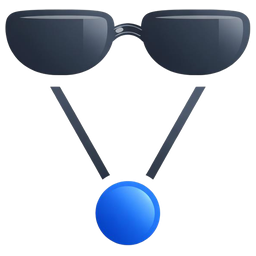

<p align="center">
  <picture>
    <source media="(prefers-color-scheme: dark)" srcset="assets/images/logo-256-dark.png">
    
  </picture>
</p>

# Agent Graph

Records how AI coding sessions relate to each other: which session spawned which agents, who is waiting on whom, what's waiting on *you*, what looks stuck, what work is left, and what they sent each other. It works from provider hooks and writes an append-only log on your local machine. Nothing leaves it unless you choose to share.

Supported so far: **Claude Code**, **Codex** and **Cursor**. Runs on Windows, macOS and Linux.

See [docs/idea.md](docs/idea.md) for the goal and [docs/design.md](docs/design.md) for how it works.

## Install

Pick one:

| | Command |
|---|---|
| macOS (Homebrew, also on Linux) | `brew tap chofter/tap && brew trust chofter/tap && brew install --cask chofter/tap/agent-graph` |
| macOS and Linux | `curl -fsSL https://agentgraph.chofter.com/install.sh \| sh` (no curl? `wget -qO- https://agentgraph.chofter.com/install.sh \| sh`) |
| Windows (in PowerShell) | `irm https://agentgraph.chofter.com/install.ps1 \| iex` |
| macOS, Linux and Windows, with Node (npm) | `npm install -g @chofter/agent-graph` |
| From source (Rust stable) | `cargo install --path .` |

Then:

```bash
agent-graph install claude-code
```

This does two things:
- **Recording:** adds hooks to `~/.claude/settings.json`. It keeps everything else in the file and backs it up first. New Claude Code sessions are recorded from then on, including sessions one starts from its shell (`claude -p`, `codex exec`, …), which appear under it. Installed before that was added? Run `install` again to update the hooks.
- **The `/agent-graph` command:** adds a skill you can run in any session. It gives you a picture of the session and a short summary of what needs you, what's stuck and what's in progress, sent to you when the app can show files. `/agent-graph all` covers every recent session, and `/agent-graph share` gives you a live link.

Options:
- `--scope project` or `--scope local` to install for just this project
- `--dry-run` to preview the changes
- `--no-slash-command` for the hooks alone

`agent-graph uninstall claude-code` removes both.

For **Codex**, `agent-graph install codex` does the same:
- **Recording:** adds hooks to `~/.codex/hooks.json` (or `$CODEX_HOME`'s), keeping everything else there and backing it up first. Codex only runs a hook once it's trusted, so it also trusts these, in Codex's `config.toml`, as Codex's `/hooks` would, changing nothing else there. It also turns on Codex's plan tool (off by default), unless your settings say otherwise. New Codex sessions are recorded from then on, in the terminal (`codex`, `codex exec`) and in the ChatGPT desktop app, which runs the same Codex: their plans, the subagents they start and wait for, when they need your approval or an answer, and sessions they start from their shell (`claude -p`, …), which appear under them.
- **The `$agent-graph` command**, in `~/.agents/skills/agent-graph/`.

`agent-graph uninstall codex` removes all of it. [docs/codex.md](docs/codex.md) has the details.

For **Cursor**, `agent-graph install cursor` adds hooks to `~/.cursor/hooks.json`, keeping everything else there, and the `/agent-graph` command. New chats are recorded from then on, in the Cursor app and its CLI (`agent`): their subagents, todo lists and names. Cursor's hooks don't say when a chat is waiting for you, so what it's waiting on (a command to approve, a question, a plan to review) comes from Cursor's own records of the chat, read while `agent-graph view` or `watch-remote` runs. `agent-graph uninstall cursor` removes it. [docs/cursor.md](docs/cursor.md) has the details.

**In the cloud**, sessions are recorded and shared live, to your account at [agentgraph.chofter.com/watch](https://agentgraph.chofter.com/watch), given an API token from your account page as `AGENT_GRAPH_TOKEN` in the cloud environment's settings:
- **Claude Code's cloud** (claude.ai/code): `agent-graph install claude-code --cloud` adds hooks to the project's `.claude/settings.json`, to commit.
- **Codex's cloud** (chatgpt.com/codex): the environment's setup script runs the install script, then `~/.local/bin/agent-graph install codex --cloud --yes`, which adds the hooks to Codex's files in the cloud. [docs/codex-cloud.md](docs/codex-cloud.md) has the details.
- **Cursor's cloud agents**: `agent-graph install cursor --cloud --scope project` adds hooks to the project's `.cursor/hooks.json`, to commit; the token is a secret in Cursor's dashboard (Cloud Agents → Secrets).

The site's [Download section](https://agentgraph.chofter.com/#install) has the steps for each, page by page.

For Gemini CLI, `install` adds the same command:

| Agent | Command | Written to |
|---|---|---|
| Gemini CLI | `agent-graph install gemini` | `~/.gemini/commands/agent-graph.toml` |

Its own sessions aren't recorded yet; only Claude Code, Codex and Cursor have hooks so far.

`agent-graph --help` gives an overview, and `agent-graph <command> --help` explains a command in full, with examples. The same text is on the web at [agentgraph.chofter.com/docs](https://agentgraph.chofter.com/docs).

## Look at your agents

| Command | What it does |
|---|---|
| `agent-graph tail` | Live, full-screen tree in the terminal, redrawn as events arrive. `q` quits, `a` shows older sessions, `--ascii` for plain characters. |
| `agent-graph view --open` | Live web view on port 7777 (it prints a link with a key, `http://127.0.0.1:7777/?key=…`; only that link works; a viewer already running on the port is replaced, so a newer version takes over). Has a timeline slider for stepping back through a session, saves images, and reopens a Claude Code or Codex session, or a chat in Cursor's CLI: in the Claude app or the ChatGPT app if that's where it ran, else in a new terminal window. |
| `agent-graph snapshot` | Saves a phone-sized PNG of the current session and prints its path, ready for an agent to send you. `--out x.svg` for SVG, `--json` for the raw graph. |
| `agent-graph tree` | One-off text tree (`--all` includes older sessions). |
| `agent-graph watch-remote` | Shares the graph live to your account at [agentgraph.chofter.com](https://agentgraph.chofter.com), where only you can see it. See below. |
| `agent-graph run -- <command>` | Runs any command as a node in the graph, e.g. an agent without hooks (`agent-graph run -- aider`) or a script that starts several agents, which then appear under it. Exits with the command's exit code. |

```
claude-code:e0000002  search-indexer  [working]  Rebuilding the index schema (+1 pending)  tasks 0/2  waiting on 1 node (0 open tasks), Explore a91d0160 looks stuck
└─ Explore a91d0160  [working] (stale?)  Profile the slow bulk import
```

Every view flags three kinds of trouble:
- **Needs you:** a permission prompt, a question, or a plan waiting for approval.
- **Stale?:** working but silent for 30 minutes (change with `--stale-minutes`).
- **Deadlock:** sessions waiting on each other.

To see all of these at once, open the [example logs](examples/README.md).

## Share

```bash
agent-graph watch-remote
```

This shares the graph to your account on the site and keeps it updated as your agents work, until you stop it. See it at [agentgraph.chofter.com/watch](https://agentgraph.chofter.com/watch), logged in: it's the same viewer as `view`, and only you can see it. The first time, it opens your browser to log in (with Google, or an email and password), and keeps the login for next time. Sharing live is free for your account's first week; after that, it opens your account page to subscribe, and carries on once you have. You can also paste or upload a log at [agentgraph.chofter.com](https://agentgraph.chofter.com), and share its link with anyone.

Run it again later and it carries on with the same share, without sending what the site already has. `--new` starts a new one.

The site keeps a log's recent history: its last 1,000 to 2,000 events, with where everything stood before them. A log that has had no event for a week is deleted. Your own log keeps everything.

| Option | Effect |
|---|---|
| `--session=…` | Shares one session instead of all of them. |
| `--new` | Starts a new share, rather than carry on with the last one. |
| `--logout` | Logs this computer out of the site, and forgets the login. |
| `--url=…` | Shares to another copy of the site, e.g. `http://localhost:3000` while developing it. |

Only you can see a live share, and only the machine that created it can add to it: every update must carry a key the site returned when the share was created, kept in a file only you can read. The site is in [site/](site/README.md).

Events live in `~/.agent-graph/events/`, one JSON Lines file per session. The format is defined in [schema/event.schema.json](schema/event.schema.json).

| Environment variable | Effect |
|---|---|
| `AGENT_GRAPH_HOME` | Use a different data directory |
| `AGENT_GRAPH_RAW=1` | Also save raw hook payloads to `raw/`, for building adapters |
| `AGENT_GRAPH_CAPTURE_BODIES=1` | Keep message bodies and final agent messages (off by default) |
| `AGENT_GRAPH_NOW` | Pretend it's this time (RFC 3339) when reading logs; used to view the examples |
| `AGENT_GRAPH_AGENT_COMMANDS` | More programs (comma separated) that start an agent session when an agent runs them from its shell (wrappers that start Claude Code, say): any session started from that shell may be the one they started |

A session passes its identity to anything it starts through `AGENT_GRAPH_PARENT` and a W3C `TRACEPARENT` in its shell's environment, so a session started from another links itself under it. When those are missing, it's matched by process instead.

## Release

Push a version tag (`git tag v0.1.0 && git push origin v0.1.0`) and [dist](https://axodotdev.github.io/cargo-dist/) builds, signs and publishes the binaries for every platform. See [docs/release.md](docs/release.md) for what's published where, the macOS notarization, and the one-time setup.

## Develop

```bash
cargo test
```

All the help text lives in [docs/cli-help.json](docs/cli-help.json). `build.rs` compiles it into the binary, and the site's /docs page renders the same file, so edit it there, never in code. A test fails if a command or option has no help text, or if the file describes one that doesn't exist.

The example logs are generated by `tests/examples.rs`; see [examples/README.md](examples/README.md) to regenerate them. The site has its own setup; see [site/README.md](site/README.md).

## License

[MIT](LICENSE)
